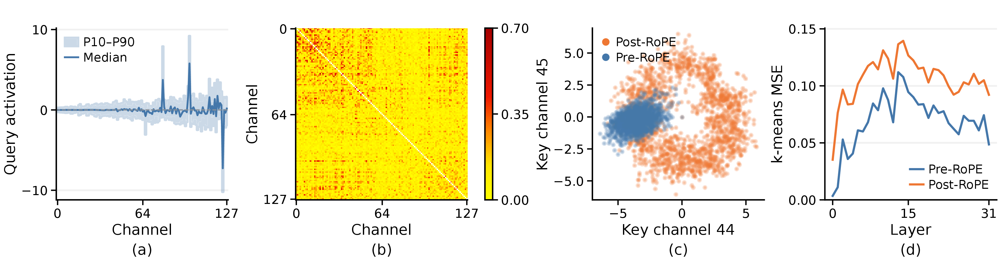
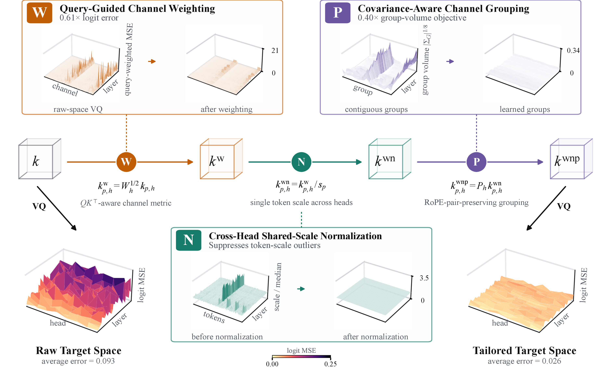
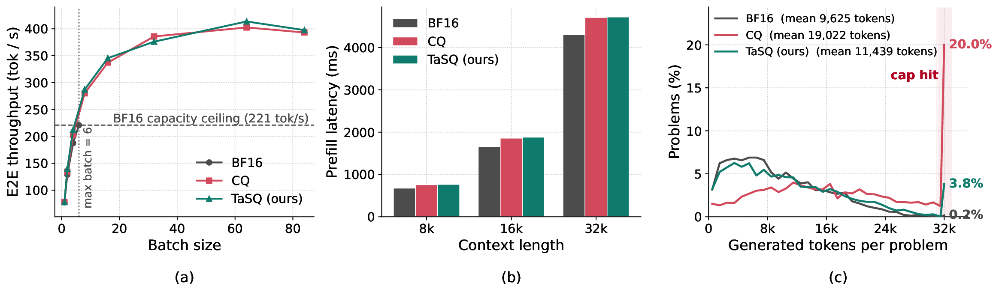

<aside class="tldr" aria-label="TL;DR" markdown="1">

**TL;DR:** KV cache VQ struggles in the ~1-bit regime because standard VQ in the raw space does not reflect error sensitivity and inter-channel dependencies. TaSQ tailors the VQ target space to account for both, significantly reducing quantization error!

</aside>

**TaSQ** (**Ta**ilored **S**pace for Vector **Q**uantization) is an LLM KV cache vector quantization (VQ) method that tailors the quantization space for accurate ultra-low-bit compression.
Through **query-guided channel weighting** and **covariance-aware grouping**, TaSQ makes the VQ target space better reflect channel-wise sensitivity and inter-channel dependencies.
Consequently, TaSQ substantially reduces quantization error in the 1-bit regime, outperforming existing baselines across general, reasoning, and long-context retrieval benchmarks.
Our SGLang implementation supports up to **14×** larger batch sizes and achieves **1.87×** higher peak throughput compared to the BF16 baseline.

<section id="motivations" markdown="1">

## Motivations {#motivations-heading}

<!-- Although VQ methods achieve strong quantization quality, preserving it in the 1-bit regime remains challenging. Since codebook capacity is highly limited at such rates, it becomes difficult to construct codebooks that effectively represent the activations. To address this challenge, we focus on **tailoring the quantization space**, rather than exploring more sophisticated codebook designs. Our approach is motivated by three observations: key channels vary substantially in their sensitivity to quantization error, exhibit non-uniform inter-channel dependencies, and become more difficult to quantize after RoPE. -->

<figure markdown="1">

<figcaption markdown="1">
**Figure 1.** Key-channel structure in Llama-3.1-8B: (a) query activation ranges, (b) absolute key correlations, (c) key distributions before and after RoPE, and (d) VQ reconstruction error across layers. All panels use the same 2,048-token GPQA window; (a–c) show layer 15, KV head 0.
</figcaption>
</figure>

**1. Sensitivity of key channels to queries.** Quantization errors in different key channels affect attention scores differently depending on the corresponding query activations. **Figure 1a** shows that query distributions vary substantially across channels, implying unequal sensitivity of key channels to reconstruction error. This is misaligned with the objective of Euclidean VQ, which treats all channels equally.

**2. Inter-channel correlation.** Key channels exhibit non-uniform dependencies, as shown in **Figure 1b**: some channel pairs are strongly correlated, while others are nearly independent. Since VQ represents multiple channels jointly with a shared codebook, its ability to exploit these dependencies depends on which channels are grouped together.

**3. Pre-RoPE vs. post-RoPE keys.** RoPE applies position-dependent rotations that spread the relatively compact pre-RoPE key distribution, as shown in **Figure 1c**. This makes post-RoPE keys harder to represent with a shared codebook. Consistently, **Figure 1d** shows that pre-RoPE VQ achieves 35% lower total reconstruction error.
</section>

<section id="method" markdown="1">

## Method {#method-heading}

<figure markdown="1">

<figcaption markdown="1">
**Figure 2.** Overview of TaSQ.
</figcaption>
</figure>

The figure above illustrates the overall pipeline of TaSQ. Three transformations are applied sequentially to tailor the pre-RoPE key space, and the effect of each step is visualized in the figure.

**1. Query-guided Channel Weighting.** We derive channel weights from query–key dot-product error and rescale key channels accordingly. Euclidean reconstruction error in the weighted space then serves as a surrogate for expected squared attention-logit error.

**2. Cross-head Shared-scale Normalization.** We normalize each token using a single scale shared across all KV heads. This suppresses token-level magnitude outliers while keeping normalization metadata small.

**3. Covariance-aware Channel Grouping.** We group dependent channels into the same VQ codebook using a covariance-based criterion. Groups preserve complete RoPE pairs, allowing RoPE to remain efficient at inference time.

Weighting and grouping are absorbed into projection weights and decoder codebooks offline, while codeword lookup, scale restoration, RoPE, and the query–key dot product are fused into the attention kernel. Values use standard VQ with contiguous channel groups.

</section>

<section id="results" markdown="1">

## Experimental Results {#results-heading}

<!-- Existing benchmark controls and tables remain unchanged. -->

Benchmark
<button role="tab" id="tab-general" aria-controls="general" aria-selected="true">General capabilities</button><button role="tab" id="tab-reasoning" aria-controls="reasoning" aria-selected="false" tabindex="-1">Long-CoT reasoning</button><button role="tab" id="tab-retrieval" aria-controls="retrieval" aria-selected="false" tabindex="-1">Long-context retrieval</button>

<label class="control-label" for="model-select">Model</label><select id="model-select"></select>

| Model | Method | Bits (K/V) | GSM8K | MATH500 | MBPP | HumanEval | BBH | MMLU | Avg. |
| :--- | :--- | ---: | ---: | ---: | ---: | ---: | ---: | ---: | ---: |
| Llama-3.1-8B-Instruct | BF16 | 16.000/16.000 | 83.62 | 42.20 | 59.60 | 62.20 | 73.38 | 62.64 | 63.94 |
| Llama-3.1-8B-Instruct | CQ | 1.250/1.250 | 68.01 | 19.60 | 52.00 | 54.27 | 40.08 | 54.21 | 48.03 |
| Llama-3.1-8B-Instruct | NovaKV | 1.375/1.250 | 76.95 | 29.40 | 55.00 | 53.66 | 48.46 | 56.43 | 53.32 |
| Llama-3.1-8B-Instruct | NSNQuant | 1.238/1.238 | 73.39 | 31.40 | 50.20 | 57.93 | 48.57 | **58.33** | 53.30 |
| Llama-3.1-8B-Instruct | TaSQ | 1.266/1.250 | **81.73** | **34.00** | **58.40** | **58.54** | **64.28** | **58.33** | **59.21** |
| Qwen3-4B | BF16 | 16.000/16.000 | 86.28 | 72.60 | 64.00 | 81.71 | 78.03 | 74.72 | 76.22 |
| Qwen3-4B | CQ | 1.250/1.250 | 70.36 | 60.80 | 45.40 | 65.85 | 52.08 | 64.14 | 59.77 |
| Qwen3-4B | NovaKV | 1.375/1.250 | 84.53 | 66.80 | **62.60** | 76.22 | **68.80** | 67.21 | 71.03 |
| Qwen3-4B | NSNQuant | 1.238/1.238 | 65.58 | 52.40 | 46.20 | 67.68 | 49.57 | 63.29 | 57.45 |
| Qwen3-4B | TaSQ | 1.266/1.250 | **85.44** | **69.80** | **62.60** | **77.44** | 68.28 | **71.26** | **72.47** |

| Model | Method | Bits (K/V) | AIME'24 | AIME'25 | LCB-v6 | SciBench | Avg. |
| :--- | :--- | ---: | ---: | ---: | ---: | ---: | ---: |
| Qwen3-4B-Thinking-2507 | BF16 | 16.000/16.000 | 74.44 ± 1.92 | 74.44 ± 5.09 | 45.85 ± 0.62 | 73.99 ± 0.43 | 67.18 ± 1.37 |
| Qwen3-4B-Thinking-2507 | CQ | 1.250/1.250 | 26.67 ± 3.33 | 14.44 ± 5.09 | 18.99 ± 0.44 | 54.00 ± 0.94 | 28.52 ± 1.54 |
| Qwen3-4B-Thinking-2507 | NovaKV | 1.375/1.250 | 7.78 ± 1.92 | 6.67 ± 3.33 | 9.16 ± 0.38 | 27.94 ± 2.08 | 12.89 ± 1.10 |
| Qwen3-4B-Thinking-2507 | NSNQuant | 1.238/1.238 | 44.44 ± 6.94 | 38.89 ± 1.92 | 34.66 ± 0.33 | 68.69 ± 0.55 | 46.67 ± 1.81 |
| Qwen3-4B-Thinking-2507 | TaSQ | 1.266/1.250 | **68.89 ± 1.92** | **56.67 ± 3.33** | **43.00 ± 0.47** | **73.65 ± 0.60** | **60.55 ± 0.98** |
| DeepSeek-R1-Distill-Llama-8B | BF16 | 16.000/16.000 | 53.33 ± 3.33 | 31.11 ± 1.92 | 39.68 ± 0.56 | 38.49 ± 0.30 | 40.65 ± 0.98 |
| DeepSeek-R1-Distill-Llama-8B | CQ | 1.250/1.250 | 26.67 ± 3.33 | 26.67 ± 5.77 | 23.29 ± 0.45 | 35.45 ± 1.61 | 28.02 ± 1.72 |
| DeepSeek-R1-Distill-Llama-8B | NovaKV | 1.375/1.250 | 35.56 ± 5.09 | 18.89 ± 3.85 | 20.98 ± 0.65 | 33.62 ± 0.44 | 27.26 ± 1.61 |
| DeepSeek-R1-Distill-Llama-8B | NSNQuant | 1.238/1.238 | 44.44 ± 5.09 | 24.44 ± 5.09 | 32.67 ± 1.15 | 34.83 ± 1.64 | 34.10 ± 1.87 |
| DeepSeek-R1-Distill-Llama-8B | TaSQ | 1.266/1.250 | **48.89 ± 6.94** | **31.11 ± 1.92** | **32.95 ± 0.61** | **39.11 ± 1.50** | **38.02 ± 1.85** |
| Phi4-14B-Reasoning-Plus | BF16 | 16.000/16.000 | 71.11 ± 1.92 | 66.67 ± 3.33 | 46.60 ± 0.71 | 48.22 ± 1.03 | 58.15 ± 1.01 |
| Phi4-14B-Reasoning-Plus | CQ | 1.250/1.250 | 52.22 ± 3.85 | 31.11 ± 5.09 | 13.33 ± 0.55 | 33.14 ± 1.34 | 32.45 ± 1.64 |
| Phi4-14B-Reasoning-Plus | NovaKV | 1.375/1.250 | 41.11 ± 10.18 | 35.56 ± 1.92 | 21.93 ± 0.29 | 41.57 ± 1.86 | 35.04 ± 2.63 |
| Phi4-14B-Reasoning-Plus | NSNQuant | 1.238/1.238 | 63.33 ± 6.67 | 55.56 ± 5.09 | 37.12 ± 1.04 | 44.99 ± 0.65 | 50.25 ± 2.12 |
| Phi4-14B-Reasoning-Plus | TaSQ | 1.263/1.250 | **71.11 ± 5.09** | **60.00 ± 0.00** | **41.20 ± 0.52** | **50.58 ± 1.90** | **55.72 ± 1.36** |

| Model | Method | Bits (K/V) | 4k | 8k | 16k | 32k | 64k |
| :--- | :--- | ---: | ---: | ---: | ---: | ---: | ---: |
| Llama-3.1-8B-Instruct | BF16 | 16.000/16.000 | 98.50 ± 1.73 | 98.83 ± 0.76 | 98.67 ± 0.29 | 98.67 ± 0.76 | 98.17 ± 1.04 |
| Llama-3.1-8B-Instruct | CQ | 1.250/1.250 | 19.33 ± 1.61 | 15.50 ± 3.61 | 12.67 ± 1.26 | 12.83 ± 3.18 | 6.33 ± 1.26 |
| Llama-3.1-8B-Instruct | NovaKV | 1.375/1.250 | 84.83 ± 0.29 | 81.67 ± 3.18 | 64.00 ± 2.18 | 21.33 ± 2.25 | 1.83 ± 0.29 |
| Llama-3.1-8B-Instruct | NSNQuant | 1.238/1.238 | 89.17 ± 1.61 | 86.00 ± 1.32 | 86.83 ± 4.25 | 88.17 ± 1.15 | 82.17 ± 0.58 |
| Llama-3.1-8B-Instruct | TaSQ | 1.266/1.250 | **93.33 ± 2.08** | **93.17 ± 0.76** | **92.00 ± 1.32** | **93.67 ± 1.04** | **93.17 ± 0.76** |
| Qwen3-4B-Thinking-2507 | BF16 | 16.000/16.000 | 100.00 ± 0.00 | 100.00 ± 0.00 | 99.83 ± 0.29 | 99.67 ± 0.29 | 95.33 ± 2.36 |
| Qwen3-4B-Thinking-2507 | CQ | 1.250/1.250 | 71.50 ± 1.73 | 63.33 ± 4.01 | 48.17 ± 0.29 | 21.83 ± 1.04 | 10.50 ± 2.78 |
| Qwen3-4B-Thinking-2507 | NovaKV | 1.375/1.250 | **99.83 ± 0.29** | 27.67 ± 2.25 | 0.00 ± 0.00 | 0.00 ± 0.00 | 0.00 ± 0.00 |
| Qwen3-4B-Thinking-2507 | NSNQuant | 1.238/1.238 | 97.83 ± 2.47 | 97.00 ± 0.50 | 93.67 ± 0.76 | 91.17 ± 0.29 | 73.00 ± 2.18 |
| Qwen3-4B-Thinking-2507 | TaSQ | 1.266/1.250 | **99.83 ± 0.29** | **98.67 ± 0.76** | **98.83 ± 0.58** | **98.50 ± 0.00** | **81.50 ± 1.50** |
| Phi4-14B-Reasoning-Plus | BF16 | 16.000/16.000 | 99.83 ± 0.29 | 99.83 ± 0.29 | 99.67 ± 0.29 | 99.50 ± 0.00 | -- |
| Phi4-14B-Reasoning-Plus | CQ | 1.250/1.250 | 62.00 ± 1.32 | 54.83 ± 3.33 | 47.67 ± 3.51 | 34.33 ± 4.25 | -- |
| Phi4-14B-Reasoning-Plus | NovaKV | 1.375/1.250 | 97.33 ± 1.26 | 91.83 ± 1.61 | 62.50 ± 3.28 | 0.00 ± 0.00 | -- |
| Phi4-14B-Reasoning-Plus | NSNQuant | 1.238/1.238 | 98.67 ± 0.76 | 98.17 ± 1.44 | 98.00 ± 0.50 | 92.67 ± 1.26 | -- |
| Phi4-14B-Reasoning-Plus | TaSQ | 1.263/1.250 | **99.83 ± 0.29** | **99.33 ± 0.76** | **98.67 ± 0.58** | **97.33 ± 0.76** | -- |

 
TaSQ achieves the best overall performance among the evaluated quantized methods across general, reasoning, and long-context benchmarks. Notably, on a long-context benchmark, its advantage becomes increasingly pronounced as the context length grows.
</section>

<section id="efficiency" markdown="1">

## Serving Efficiency {#efficiency-heading}

<figure markdown="1">

<figcaption markdown="1">
**Figure 3.** Qwen3-4B-Thinking-2507 on one RTX 6000 Ada GPU. Throughput uses 2,048-token prompts and up to 32,768 generated tokens. Prefill latency is measured at batch size 1, and generation lengths are measured on LiveCodeBench-v6.
</figcaption>
</figure>

**Throughput / TTFT.** TaSQ introduces little additional serving overhead over CQ, a minimal KV cache VQ baseline without additional runtime transformations, as shown in **Figure 3a**. Compared with BF16, TaSQ supports up to **14× larger batches** and achieves **1.87× higher peak throughput**. Although VQ encoding increases time-to-first-token by 10–14% for 8k–32k prompts, this one-time prefill cost is amortized over long generations.

**Reasoning stability.** Aggressive KV cache compression can destabilize reasoning models, leading to repetitive or unterminated generations. In **Figure 3c**, TaSQ keeps generation lengths and cap-hit rates close to BF16, while CQ more frequently reaches the 32k generation limit, wasting decoding budget on failed outputs.
</section>
